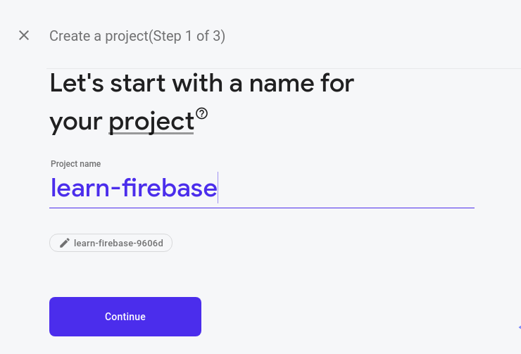
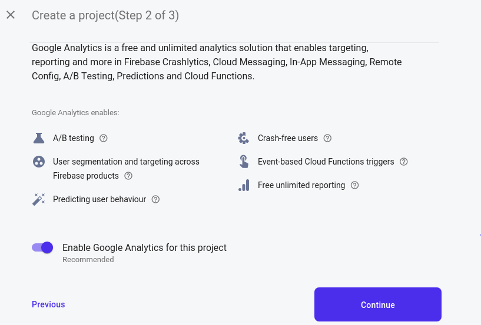
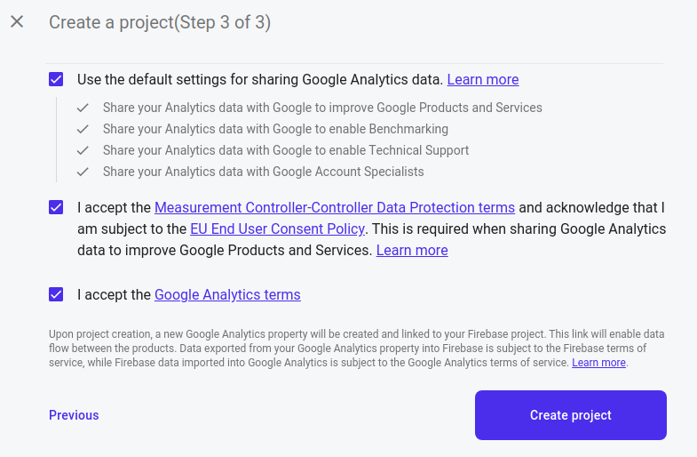
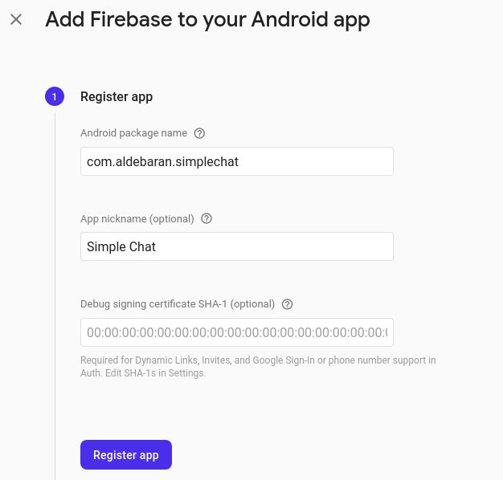
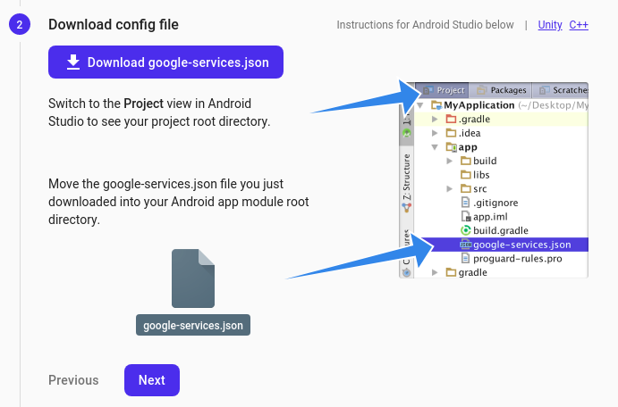

# Simple Chat App Using Firebase

## TODO Before Code

### 1. Create new project on Firebase

- Create new firebase project

  

  

  

 
 

### 2. Register the application on Firebase
- Add app (choose android)

  

- Register App. For Android package name you can  open `AndroidManifest.xml` in your project

  

- Download google-services.json and move into your project in app directory level

  

